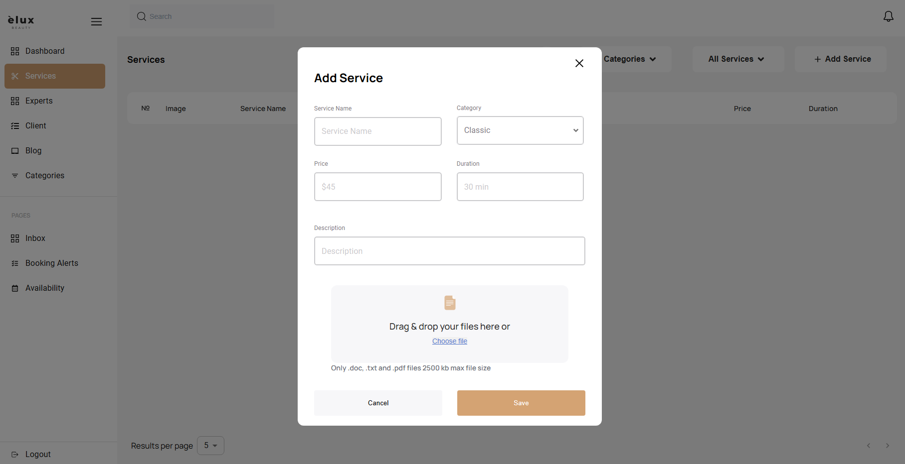
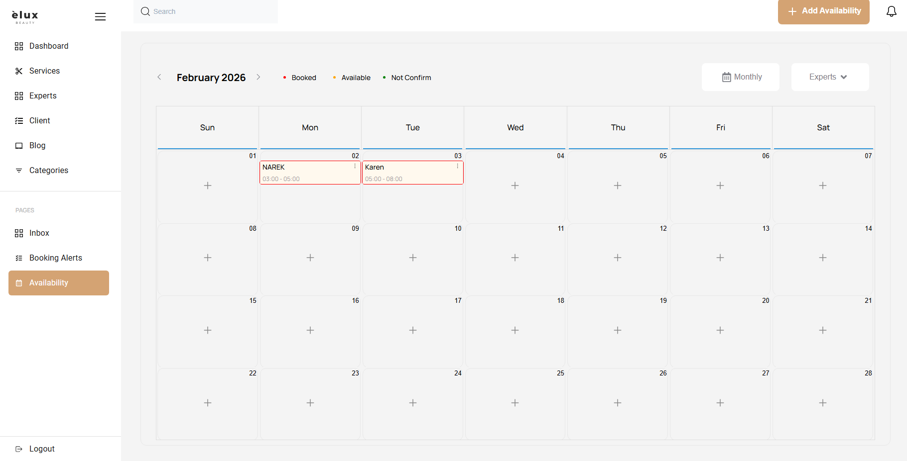
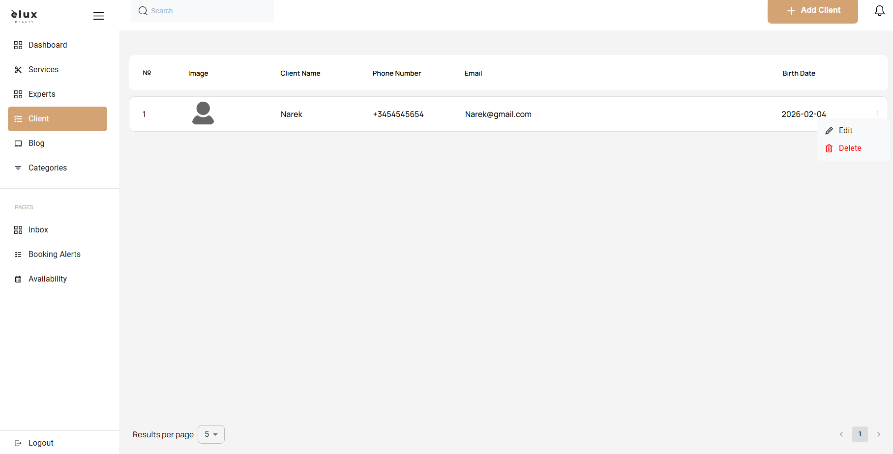
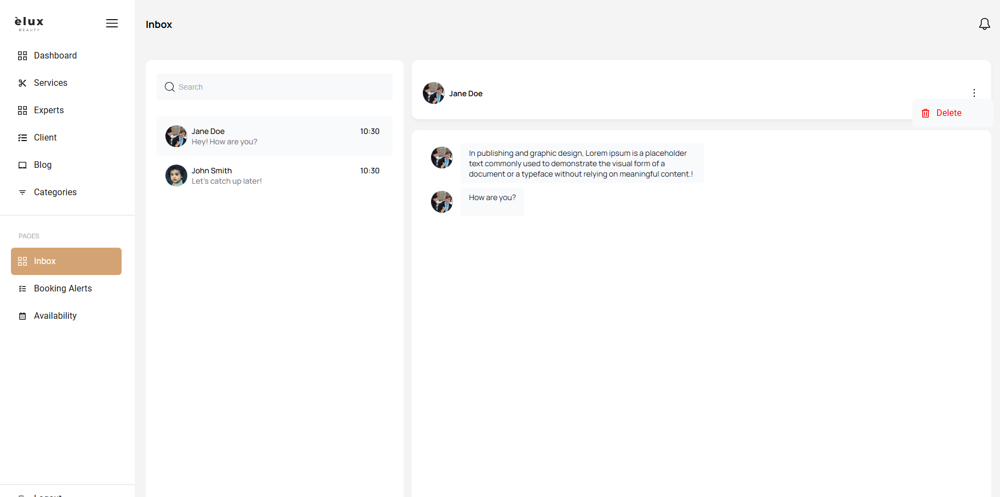

# Eluc-Beauty Admin Dashboard 🧾✨

This repository contains the Admin Dashboard for the Eluc-Beauty e-commerce application. The dashboard is intended for site administrators to manage products, orders, users, and view analytics.

Status: Prototype / in development

---

## 🚀 Live Demo
Demo: *(coming soon — add deployment URL here when available)*

---

## 🛠️ Tech Stack
- React
- Redux Toolkit 
- React Router
- Material UI (MUI) 
- JavaScript (ES6+)
- HTML, SCSS

---

## 🔑 Key Features
- Modern Admin Dashboard UI (beauty / booking system)
- Sidebar navigation with multiple sections (Dashboard, Services, Experts, Clients, Inbox, Schedule)
- Services management with full CRUD functionality (**Create / Edit / Delete**)
- Data tables with actions menu and multi-select checkboxes
- Booking schedule / availability calendar with status colors (Booked / Available / Not Confirmed)
- Inbox page with chat layout and message preview list
- Modal windows for actions (example: Logout confirmation)
- Clean UI, reusable React components, and structured project folders

---

## 📂 Project Structure
- src/
  - assets/ — images 
  - components/ — application pages and main sections
  - shared UI components - buttons, inputs, modals
  - Redax/ — Redux slices and related components
  - services/ — API clients and admin-specific endpoints
  - store/ — Redux store configuration
  - utils/ — helper functions
  - App.jsx / index.jsx — entry points

---


<div align="center">


## 📸 Screenshots

| | |
|---|---|
|  |  |
|  |  |


</div>


---

## 📂 Quick Start (Local Development)
1) Clone repository
```bash
git clone https://github.com/Narek223/Admin-dashboard.git
cd Admin-dashboard

